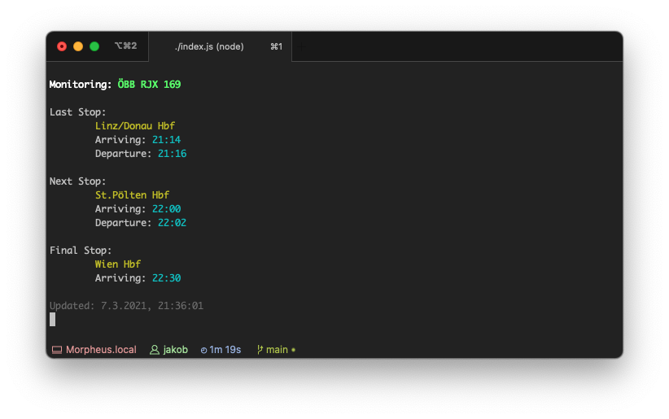

# ÖBB Watcher



## Features
- 🚂 Select train from a list
- 🎯 Pass train number as direct (optional) argument
- 🚏 List Last / Next and Final Stop
- 🔔 Terminal Beep on station change
- 🛬 Display Planned and Actual Arrival/Departure time if they divert
- ❗️ Show delay
- ⏱ Set custom update interval in seconds
## Install
`yarn install` to get all dependencies

## Run
- Run for all commands: `node index.js`  
- Run to select a train: `node index.js monitor`  
- Run directly for a specific train: `node index.js monitor RJX169`  

## Help

### index
```
Usage: index [options] [command]

Options:
  -v, --version              output the version number
  -h, --help                 display help for command

Commands:
  monitor [options] [train]  Monitor an ÖBB train
  help [command]             display help for command
```

### monitor
```
Usage: index monitor [options] [train]

Monitor an ÖBB train

Options:
  -i, --interval <time_in_s>  Update Interval in seconds
  -h, --help                  display help for command
```